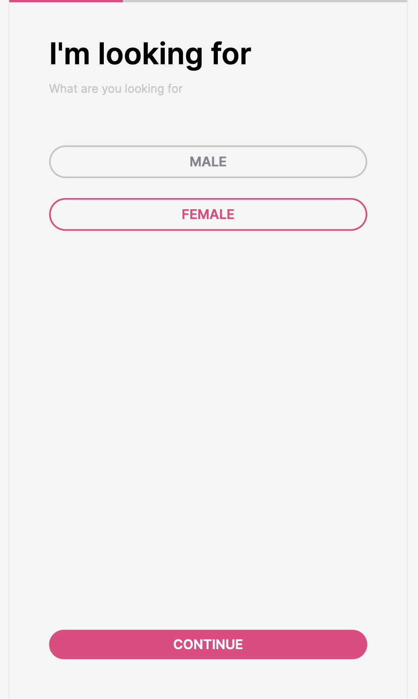
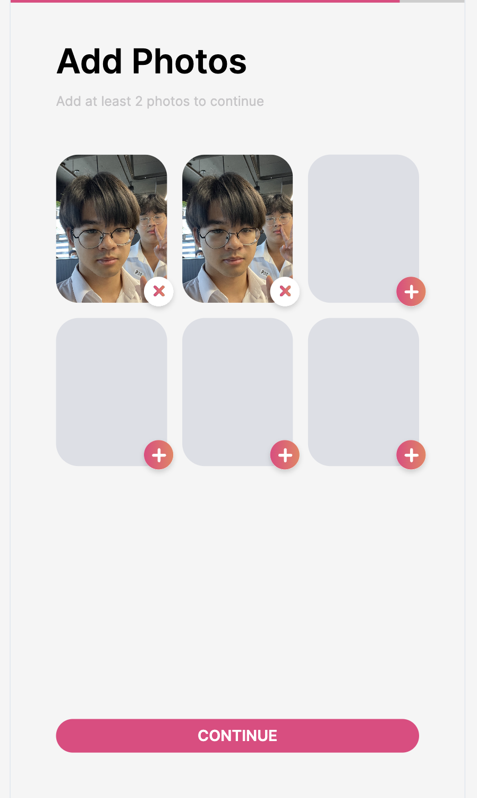

# Cvinder

Computer Engineering Essential Group 35 Final Project Report

Want to find friends? Use Cvinder to find a match in your Mycourseville class.

## Contents

- Members
- How to use
- Requirements
  - Basic Requirements
  - Challenging Requirements
- Gant chart and Assigned task
- Stack
- Setup
  - Environment variables
  - Run dev
  - Build production
    - Static only
    - Serve with express

## Members

1. Supakarin Niansupornpun 6430385121
2. Patcharapol Sankaew 6430250021
3. Pannawich Lohanimit 6532120621
4. Gongpob Phochanasom 6531302321

## How to use

- Login with MycourseVille.
- If first time follow the register step
    - Select you gender.
    
    - Select which gender you looking for.
    
    - Fill your username (can't change later)
    
    - Fill your bio (can change later)
    
    - Fill your birthdate (can't change later)
    
    - Choose your interests (can't change later)
    
    - Upload picture at least 2 (can't change later)
    
- In swipe page will show up other user, who join in the same class in your Mycourseville. You can click / tap to see other his / her profile

    - You can swipe left if you don't like
    
    - You also can swipe right if you like
    
    - If another user that use like like you too you will match with him / her
    
- In chat page you will see person, who match with you and recently chat

    - You can click another user profile to chat
    
- In profile page you will see your picture profile and your bio. You can edit your bio if you want.


## Requirements

### Basic Requirements

- The web application is a Single-page Web Application.
- The users log in to the web application using myCourseVille login.
- The web application help students to find friends in their class and his/her will not study alone they may want friends for group work or ask for help.
- The front-end of the web application does NOT use any libraries/frameworks/plugins other than what was used in Activity 7. Standard Web (JavaScript) APIs (https://developer.mozilla.org/enUS/docs/Web/API) that can be used in most modern web browsers without loading additional libraries/frameworks can be used.
- The back-end of the web application does NOT use any libraries/frameworks/plugins other than what was used in Activity 8.
- All members contribute to the development and the contribution of each member is according to a "plan" agreed among the members of the group. 

### Challenging Requirements

- The web application displays and interacts with the user nicely on different screen sizes and orientations.
- The application has a nice look and feel GUI.
- The web application has a unique feature enhancing user experience (related to the main goal of the web application) via utilization of Web API (https://developer.mozilla.org/en-US/docs/Web/API).

## Gant chart and Assigned task

## Stack

- Frontend
  - Failwindcss
  - Meen's framework
- Backend
  - Express.js
  - DynamoDB

## Setup

```bash
# install pnpm
npm i -g pnpm

# install dependencies
pnpm install
```

### Environment variables

| env | description | example |
|---|---|---|
|PORT| port for runing| 3000 |
|NODE_ENV| environment | development |
|AWS_REGION| aws region |ap-southeast-1|
|AWS_ACCESS_KEY_ID| aws access key| None |
|AWS_SECRET_ACCESS_KEY| aws secret access key | None |
|CLIENT_ID| mcv client | None|
|CLIENT_SECRET| mcv secret client |None |
|URL| host url |127.0.0.1:3000|


### Run dev

```bash
pnpm dev
```

### Build production

#### Static only

```bash
pnpm build
```

#### Serve with express

```bash
pnpm serve
```
